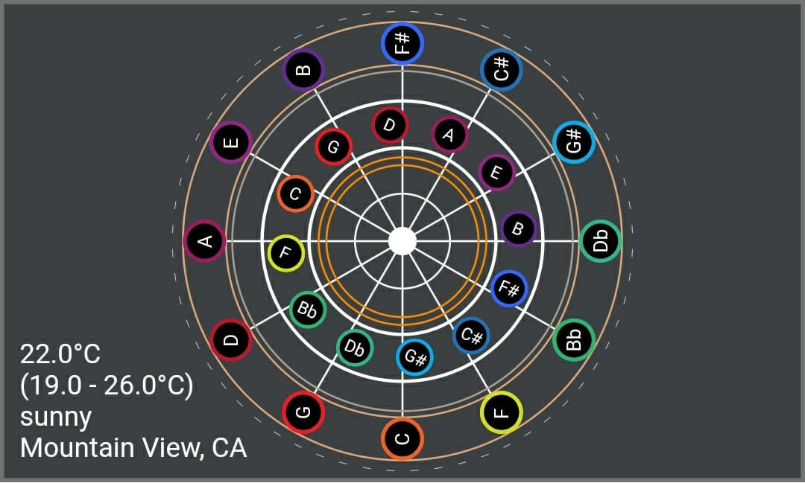

# Fifths Clock
As part of the flutter clock challange by google. 

This app is an example of an analog clock with the circle of fifths and fourths from music theory. 
The keys are orded. 
The inner circle completes a cycle every hour, the outer circle completes a cicle every 12 hours. 
You can tell what time it is by combining the notes and their positions. 

